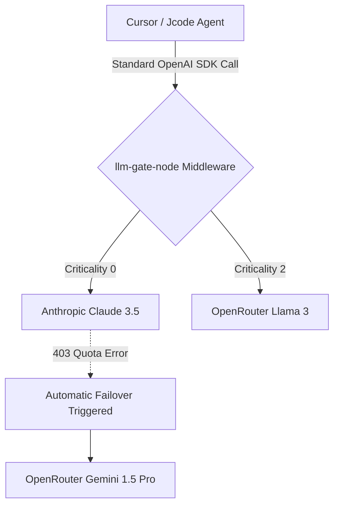

<div align="center">
  <h1>LLM-Gate: Node.js Middleware</h1>
  <p><strong>Express/TypeScript High-Availability Router for Autonomous Swarms</strong></p>
  
  
</div>

## Architecture

This Node.js middleware layer sits centrally between autonomous AI swarms and outbound API gateways such as OpenRouter and Anthropic. It intercepts OpenAI-compatible HTTP client calls, classifies request criticality, and stores a routing decision on the request before the downstream handler forwards or executes the call.



## Quickstart

Install and wrap an OpenAI-compatible route in your Express backend.

```bash
npm install @nickhq/llm-gate-node express
```

```typescript
import express from 'express';
import { LLMGateway } from '@nickhq/llm-gate-node';

const app = express();
app.use(express.json());

const router = new LLMGateway('anthropic/claude-3-opus-20240229');

// Drop-in middleware for OpenAI-compatible endpoints.
app.post('/v1/chat/completions', router.middleware(), async (req, res) => {
  const decision = req.llmRouter.decision;

  // Forward to your provider client here based on decision.provider/model.
  res.json({
    routedTo: decision.model,
    provider: decision.provider,
    tier: decision.tier,
  });
});

app.listen(process.env.PORT ?? 3000);
```

## Runtime Validation

The package exports Zod schemas for OpenAI-compatible request/response validation and routing metadata validation.

```typescript
import {
  OpenAIChatCompletionRequestSchema,
  OpenAIChatCompletionResponseSchema,
  RoutingDecisionSchema,
} from '@nickhq/llm-gate-node';

const requestPayload = OpenAIChatCompletionRequestSchema.parse(req.body);
const providerPayload = OpenAIChatCompletionResponseSchema.parse(providerJson);
const routingDecision = RoutingDecisionSchema.parse(req.llmRouter.decision);
```

Validation is strict. Unknown top-level fields, malformed message roles, invalid token counts, and incorrect OpenAI response shapes are rejected before they reach downstream provider code.

## API Deployment Examples

### 1. Standalone Express API

Use this when running the router as a dedicated service in front of agent workers.

```typescript
import express from 'express';
import { LLMGateway, OpenAIChatCompletionRequestSchema } from '@nickhq/llm-gate-node';

const app = express();
const gateway = new LLMGateway(process.env.PRIMARY_MODEL ?? 'anthropic/claude-3-opus-20240229');

app.use(express.json({ limit: '1mb' }));

app.post('/v1/chat/completions', gateway.middleware(), async (req, res, next) => {
  try {
    const payload = OpenAIChatCompletionRequestSchema.parse(req.body);
    const decision = req.llmRouter.decision;

    const upstreamBaseUrl = decision.provider === 'primary'
      ? process.env.PRIMARY_BASE_URL
      : process.env.FALLBACK_BASE_URL;

    const upstreamResponse = await fetch(`${upstreamBaseUrl}/v1/chat/completions`, {
      method: 'POST',
      headers: {
        'Content-Type': 'application/json',
        Authorization: `Bearer ${decision.provider === 'primary'
          ? process.env.PRIMARY_API_KEY
          : process.env.FALLBACK_API_KEY}`,
      },
      body: JSON.stringify({ ...payload, model: decision.model }),
    });

    res.status(upstreamResponse.status).json(await upstreamResponse.json());
  } catch (error) {
    next(error);
  }
});

app.listen(Number(process.env.PORT ?? 3000), '0.0.0.0');
```

Example environment:

```bash
PORT=3000
PRIMARY_MODEL=anthropic/claude-3-opus-20240229
PRIMARY_BASE_URL=https://api.anthropic.com
PRIMARY_API_KEY=sk-ant-...
FALLBACK_BASE_URL=https://openrouter.ai/api
FALLBACK_API_KEY=sk-or-...
```

### 2. Docker Image

```dockerfile
FROM node:22-alpine AS deps
WORKDIR /app
COPY package*.json ./
RUN npm ci

FROM deps AS build
COPY tsconfig.json ./
COPY src ./src
RUN npm run build

FROM node:22-alpine AS runtime
WORKDIR /app
ENV NODE_ENV=production
COPY package*.json ./
RUN npm ci --omit=dev
COPY --from=build /app/dist ./dist
EXPOSE 3000
CMD ["node", "dist/server.js"]
```

Build and run:

```bash
docker build -t llm-gate-node:latest .
docker run --rm -p 3000:3000 \
  -e PRIMARY_MODEL=anthropic/claude-3-opus-20240229 \
  -e PRIMARY_BASE_URL=https://api.anthropic.com \
  -e PRIMARY_API_KEY="$PRIMARY_API_KEY" \
  -e FALLBACK_BASE_URL=https://openrouter.ai/api \
  -e FALLBACK_API_KEY="$FALLBACK_API_KEY" \
  llm-gate-node:latest
```

### 3. Kubernetes Deployment

```yaml
apiVersion: apps/v1
kind: Deployment
metadata:
  name: llm-gate-node
spec:
  replicas: 3
  selector:
    matchLabels:
      app: llm-gate-node
  template:
    metadata:
      labels:
        app: llm-gate-node
    spec:
      containers:
        - name: api
          image: ghcr.io/your-org/llm-gate-node:latest
          ports:
            - containerPort: 3000
          env:
            - name: PORT
              value: "3000"
            - name: PRIMARY_MODEL
              value: anthropic/claude-3-opus-20240229
            - name: PRIMARY_BASE_URL
              value: https://api.anthropic.com
            - name: FALLBACK_BASE_URL
              value: https://openrouter.ai/api
            - name: PRIMARY_API_KEY
              valueFrom:
                secretKeyRef:
                  name: llm-gate-secrets
                  key: primary-api-key
            - name: FALLBACK_API_KEY
              valueFrom:
                secretKeyRef:
                  name: llm-gate-secrets
                  key: fallback-api-key
          readinessProbe:
            httpGet:
              path: /healthz
              port: 3000
            initialDelaySeconds: 5
            periodSeconds: 10
---
apiVersion: v1
kind: Service
metadata:
  name: llm-gate-node
spec:
  selector:
    app: llm-gate-node
  ports:
    - port: 80
      targetPort: 3000
```

### 4. Serverless Function Adapter

For Vercel, Netlify Functions, or AWS Lambda behind an Express adapter, instantiate the gateway once at module load and reuse it across invocations.

```typescript
import express from 'express';
import serverless from 'serverless-http';
import { LLMGateway } from '@nickhq/llm-gate-node';

const app = express();
const gateway = new LLMGateway(process.env.PRIMARY_MODEL);

app.use(express.json());
app.post('/v1/chat/completions', gateway.middleware(), async (req, res) => {
  res.json({ routing: req.llmRouter.decision });
});

export const handler = serverless(app);
```

Operational notes:

- Keep API keys in managed secrets, never in source control.
- Configure upstream request timeouts and retry budgets outside the middleware.
- Log `provider`, `tier`, and `latencyMs` for routing observability.
- Validate both inbound OpenAI requests and upstream provider responses with the exported Zod schemas.

## Internal Testing Matrix

This project uses Jest and Supertest for middleware behavior and Zod validation coverage. The test suite exercises Express request/response behavior, routing heuristics, malformed JSON handling, and malformed OpenAI request/response matrices.

```bash
npm test
npm run build
```
